# qlGen User Guide

**AI-Powered Qualified Lead Generation**

---

## Table of Contents

1. [What is qlGen?](#what-is-qlgen)
2. [Signing In](#signing-in)
3. [Dashboard](#dashboard)
4. [Creating a Search (ICP Wizard)](#creating-a-search-icp-wizard)
5. [Managing Saved ICPs](#managing-saved-icps)
6. [Watching the Pipeline](#watching-the-pipeline)
7. [Viewing Results](#viewing-results)
8. [Company Detail](#company-detail)
9. [Re-discovering Signals](#re-discovering-signals)
10. [All Leads](#all-leads)
11. [Exporting Data](#exporting-data)
12. [Co-Pilot Assistant](#co-pilot-assistant)
13. [Admin Features](#admin-features)
14. [Tips for Better Results](#tips-for-better-results)
15. [Frequently Asked Questions](#frequently-asked-questions)

---

## What is qlGen?

qlGen is an ICP-driven qualified lead generation tool with an AI co-pilot. You define your Ideal Customer Profile (ICP) — the type of company and decision-maker you want to reach — and qlGen's AI agent autonomously runs a multi-stage pipeline:

1. **Industry Discovery** — finds companies matching your industry and geography criteria
2. **Firmographic Fit** — filters by size, revenue, and other firmographic signals
3. **Budget Signals** — scores each company on financial capacity and spending indicators
4. **Urgency Signals** — scores each company on timing triggers and immediate need
5. **Contact Discovery** — identifies key decision-makers with verified emails and phone numbers
6. **Final Scoring** — computes composite scores and ranks all qualified companies

The result is a scored, ranked list of qualified leads you can export to Excel or CSV and start working immediately.

---

## Signing In

qlGen uses Google OAuth for authentication. Only users with authorized email addresses can access the platform.

1. Navigate to qlGen in your browser
2. Click **"Sign in with Google"** on the welcome page
3. Select your Google account and authorize access

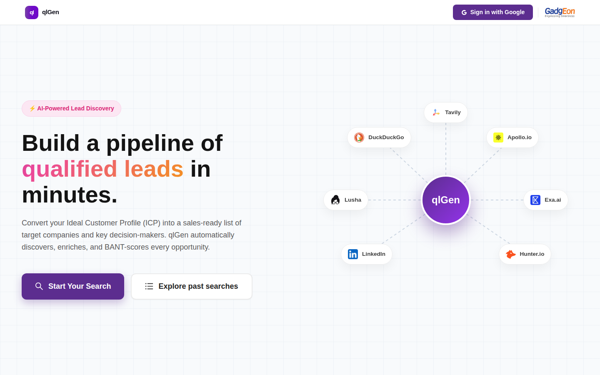

Once signed in, you'll be redirected to the Dashboard.

---

## Dashboard

The Dashboard provides an at-a-glance overview of your lead generation activity.

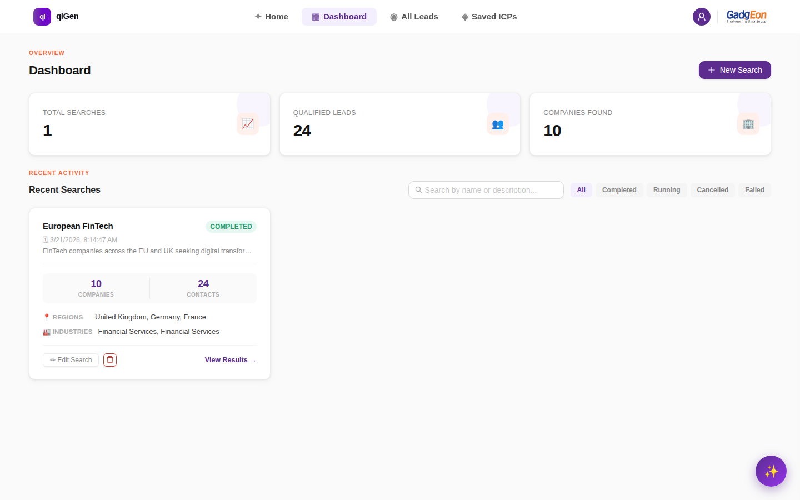

### Overview Tiles

Three summary tiles at the top show aggregate metrics:

| Tile | What It Shows |
|------|---------------|
| **Total Searches** | Number of pipeline runs across all your ICPs |
| **Qualified Leads** | Total contacts discovered across all runs |
| **Companies Found** | Total companies that passed all pipeline stages |

### Search History

Below the tiles, cards display your recent searches with:
- Status badge (Completed, Running, Failed)
- Company and contact counts
- ICP name and key criteria
- Quick actions: view results, edit the ICP, or re-run the pipeline

Use the **search bar** and **status filter chips** (All, Completed, Running, Cancelled, Failed) to find specific searches.

---

## Creating a Search (ICP Wizard)

An ICP (Ideal Customer Profile) defines the exact type of company and decision-maker you're looking for. The wizard has 6 steps.

### Step 1: Firmographics

Define the basic characteristics of your target companies.

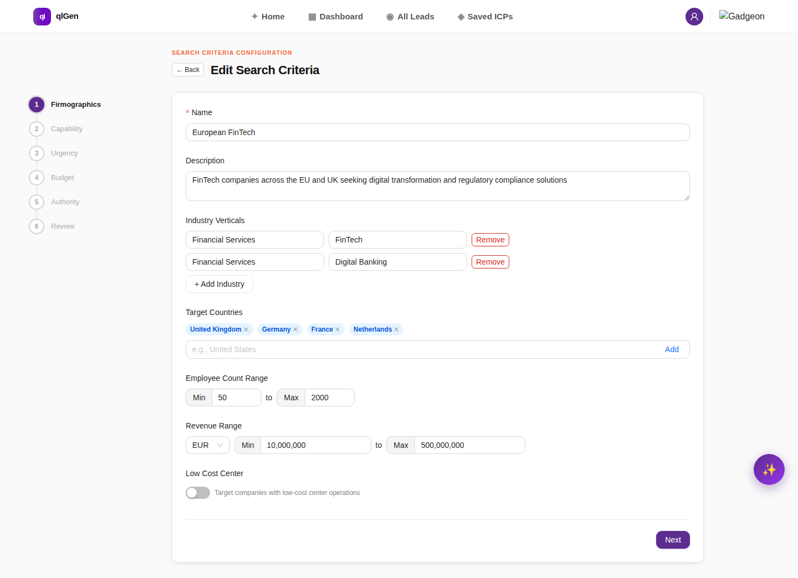

- **Name** (required): Give this search a descriptive name, e.g., *"US Enterprise SaaS Q1 2026"*
- **Description**: Optional summary
- **Industry Types**: Add one or more industry verticals with optional sub-verticals
- **Geography**: Select target countries
- **Revenue Range**: Set min/max revenue and currency
- **Employee Range**: Set min/max headcount
- **Low-Cost Center**: Toggle if targeting companies with R&D/operations centers in low-cost regions

> **Tip:** Click **"Create with AI / Upload"** at the top of this step to import ICP data from an Excel template or generate criteria with AI assistance.

### Step 2: Capability

Specify what offerings or services you want to sell.

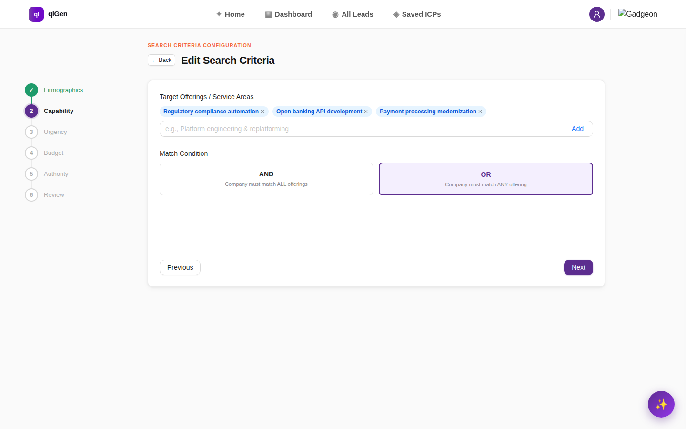

- **Target Offerings**: Add the products/services you offer (e.g., *"Cloud migration services"*, *"Platform engineering"*)
- **Match Condition**: Choose **AND** (company must match all) or **OR** (company must match any)

### Step 3: Urgency

Define signals that indicate a company has an immediate need.

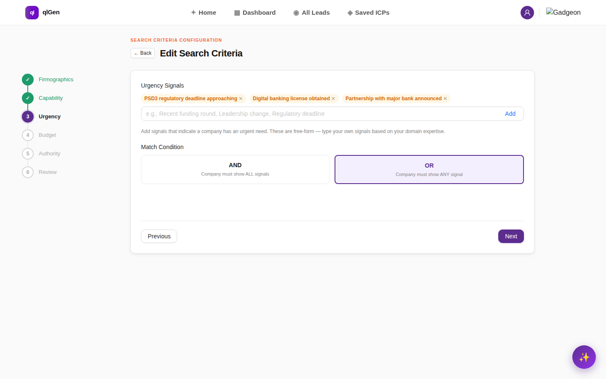

- **Urgency Signals**: Add triggers like *"Recent funding round"*, *"New CTO hired"*, *"Regulatory deadline"*
- **Match Condition**: AND or OR logic for how signals are evaluated

### Step 4: Budget

Define signals that indicate a company has the budget to buy.

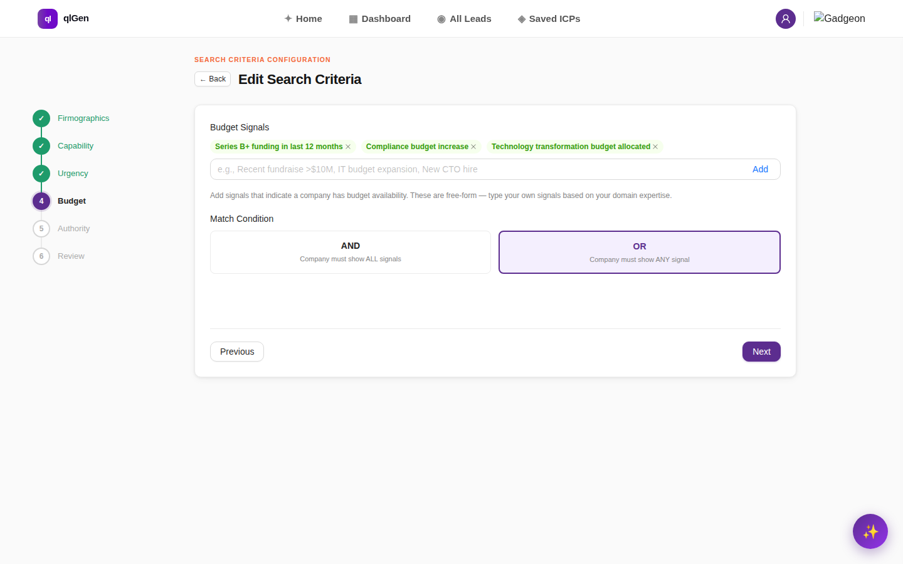

- **Budget Signals**: Add indicators like *"IT budget exceeds $5M"*, *"Recent fundraise over $50M"*
- **Match Condition**: AND or OR logic

### Step 5: Authority

Specify the decision-maker roles you want to reach.

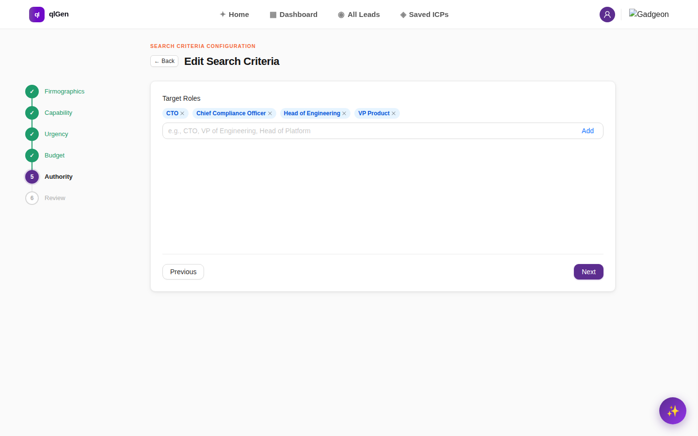

- **Target Roles**: Job titles like *CTO*, *VP of Engineering*, *Head of Digital*

### Step 6: Review

Review all your criteria before saving.

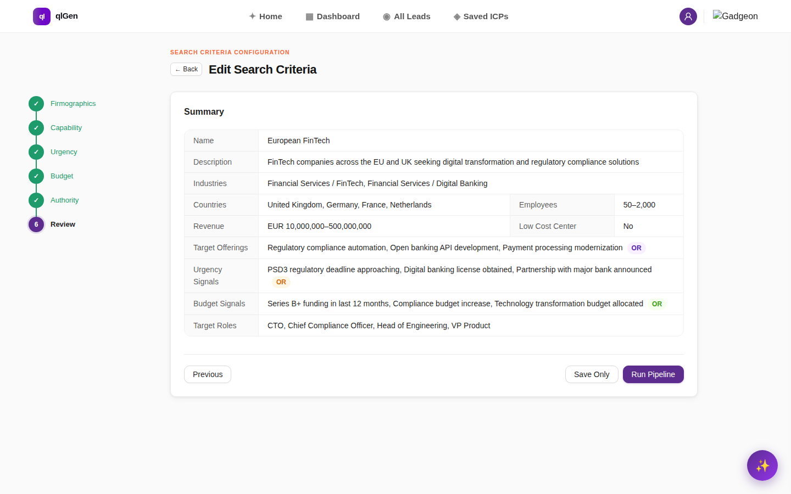

- Scan the summary to make sure nothing is missing
- Click **"Run Pipeline"** to save and immediately start the lead generation pipeline
- Click **"Save Only"** to save the ICP for later

---

## Managing Saved ICPs

The **Saved ICPs** page lists all your ICP configurations as cards.

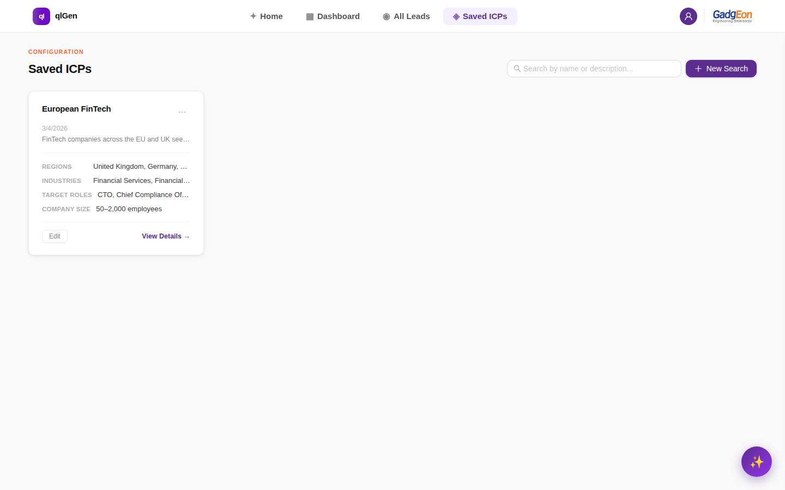

### Actions

Click the **menu button** (three dots) on any card to see options:

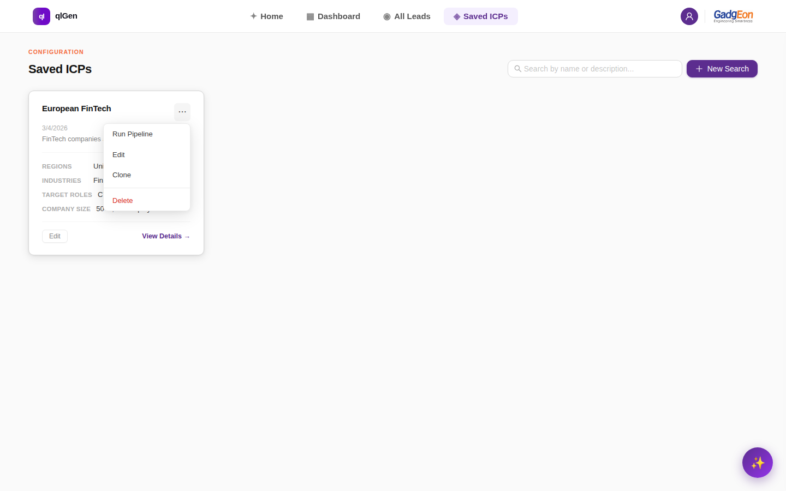

| Action | What It Does |
|--------|-------------|
| **Run Pipeline** | Start a new search using this ICP |
| **Edit** | Open the wizard to modify criteria |
| **Clone** | Create a copy of this ICP (useful for variations) |
| **Delete** | Remove the ICP (soft delete) |

### Cloning an ICP

Cloning creates an exact copy of an ICP with "Copy of " prefixed to the name (e.g., "Copy of US Enterprise SaaS"). The clone opens directly in the Review step so you can adjust any criteria before saving. This is useful when you want to create a variation — for example, the same industry criteria but targeting a different geography.

---

## Watching the Pipeline

After clicking **"Run Pipeline"**, you're taken to the Pipeline Progress page where you can watch the AI agent work in real time.

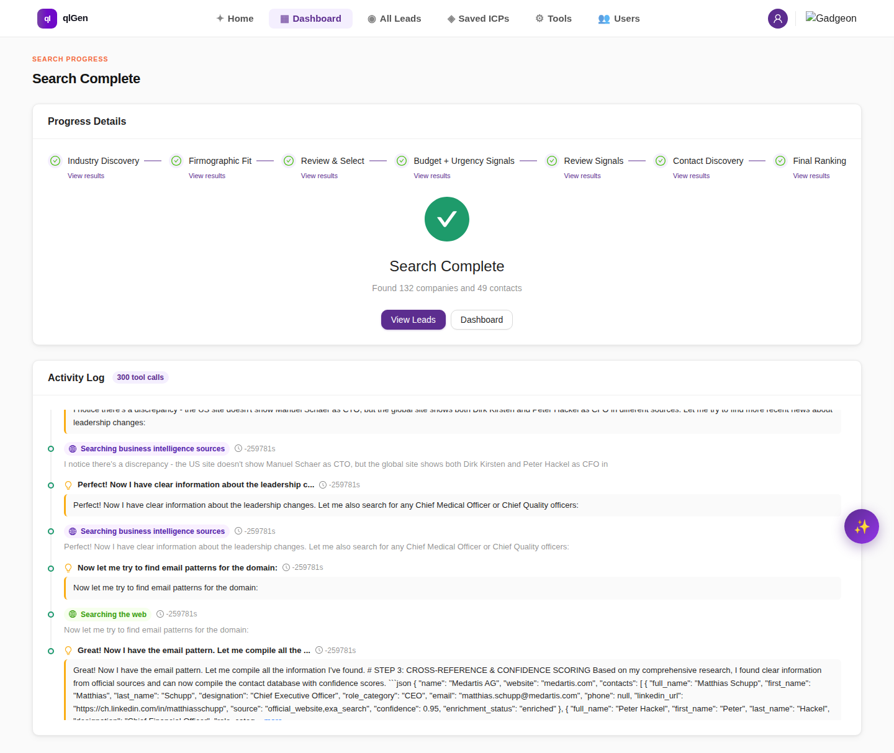

The page shows:
- **Stage progress**: Each pipeline stage (Industry Discovery, Firmographic Fit, Budget Signals, Urgency Signals, Contact Discovery, Final Scoring) with status indicators
- **Activity log**: A real-time feed of tool calls, data source lookups, and agent reasoning
- **Running totals**: Companies found, contacts discovered, tool calls made, and elapsed time

> **You can safely leave this page.** Results are saved automatically. Return anytime via the Dashboard.

---

## Viewing Results

When the pipeline completes, navigate to the results page. It has four tabs.

### Companies Tab

The default view showing all discovered companies and their scores.

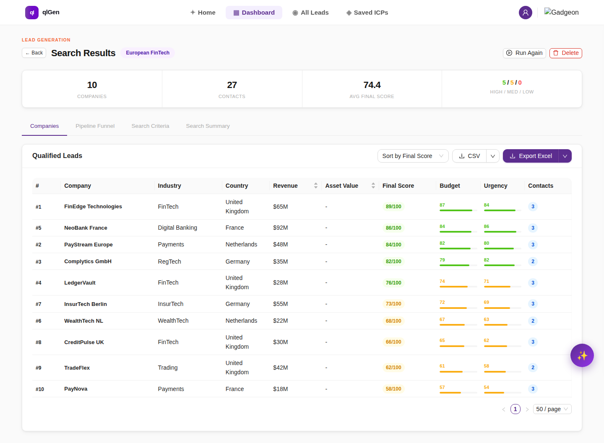

Each company row shows:
- Company name and industry
- Final score (0-100) with color-coded rating (green = High, amber = Medium, red = Low)
- Budget and urgency signal score bars
- Country, revenue, and contact count
- Click any row to open the company detail page

Use the **sort dropdown** to reorder by Final Score, Budget Score, Urgency Score, or other criteria. Click **Export Excel** or **CSV** to download.

### Pipeline Funnel Tab

A visual breakdown of how companies progressed through each pipeline stage.

Click any stage row to expand it and see which companies passed or were filtered out:

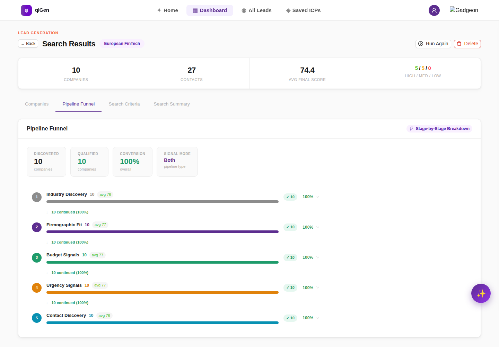

### Search Criteria Tab

Displays the ICP configuration that was used for this particular search.

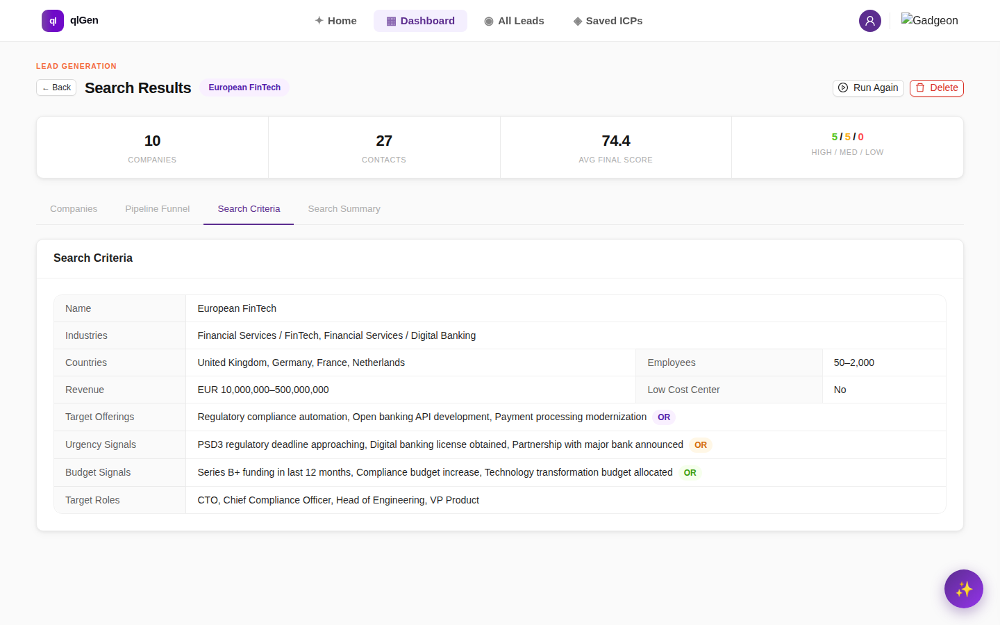

### Search Summary Tab

An overview of how the search was conducted, including tool usage statistics and data completeness metrics.

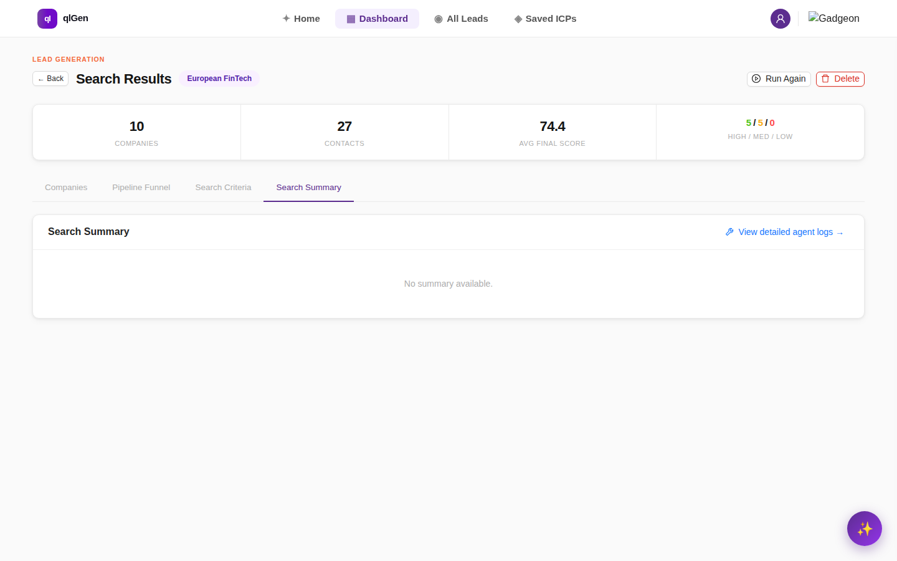

---

## Company Detail

Click on any company in the results to see its full detail page.

### Overview

Shows the company profile, ICP match score, final score, and key metrics like revenue, employee count, and qualification status.

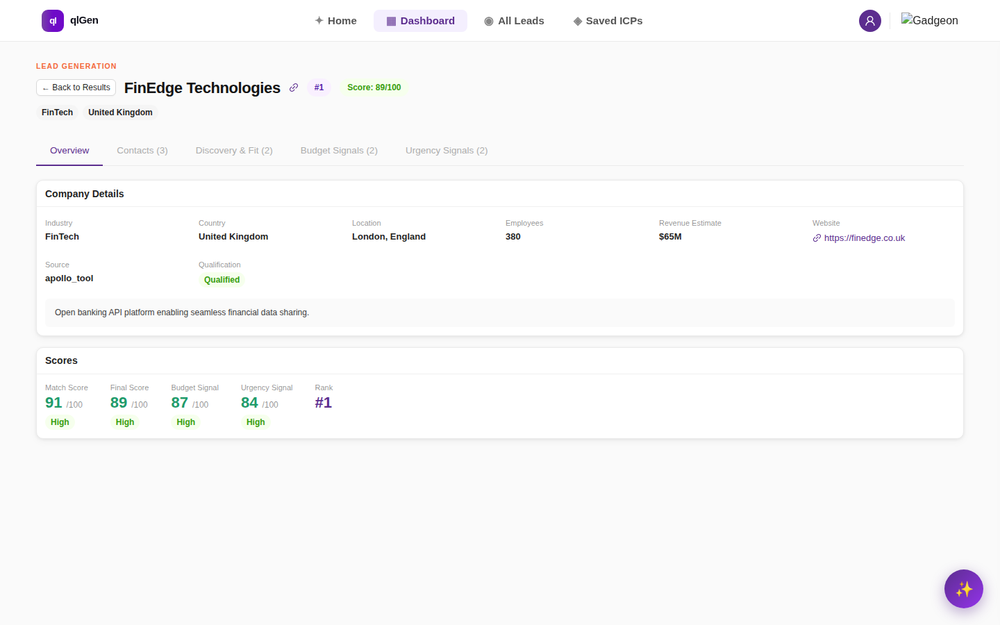

### Contacts

Lists all discovered decision-makers at this company with their title, email, phone, LinkedIn profile, and confidence score.

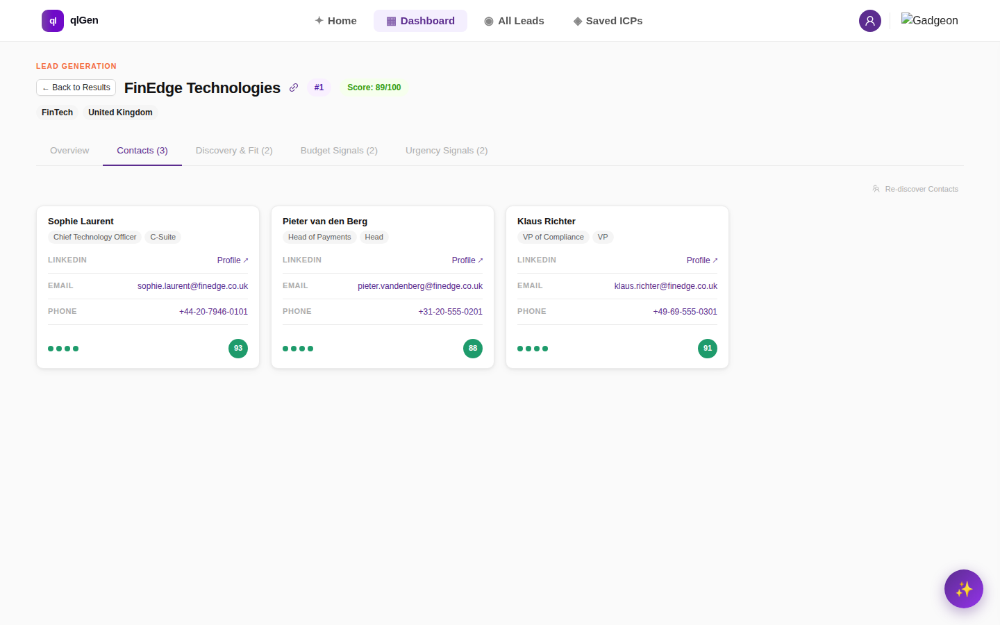

### Discovery & Fit

Shows how the company progressed through the Industry Discovery and Firmographic Fit stages, including the stage scores, pass/fail status, and the evidence that supported each decision.

### Budget Signals

Detailed budget signal evidence with individual signal scores, descriptions, source URLs, and the tools that found each signal.

### Urgency Signals

Similar to Budget Signals — shows urgency indicators with evidence and source attribution.

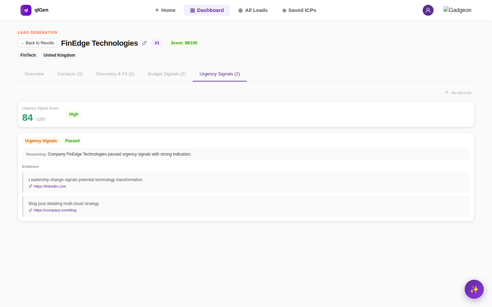

---

## Re-discovering Signals

If a company's data is stale or you want to find additional signals, use the **On-Demand Discovery** feature on the company detail page.

- **Discover Signals**: Re-runs budget and urgency signal detection for this specific company
- **Discover Contacts**: Searches for additional decision-makers at this company

The AI agent will run targeted searches and update the company's data in real time.

---

## All Leads

The **All Leads** page provides a unified view of qualified companies across all your pipeline runs.

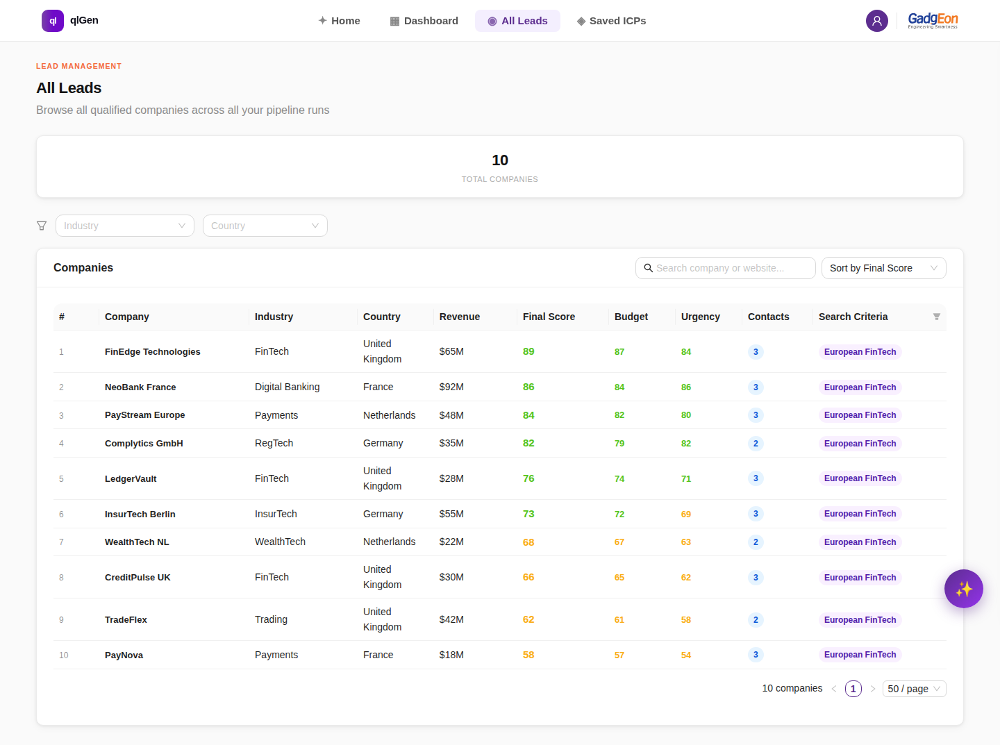

### Filtering

Use the filter bar to narrow results:

- **Industry** dropdown: Filter by company industry
- **Country** dropdown: Filter by geography
- **Search bar**: Free-text search by company name or website
- **Sort dropdown**: Order by Final Score, Budget Score, Urgency Score, etc.

Active filters show a **"Clear filters"** link to reset.

---

## Exporting Data

From the Companies tab on any search results page:

- Click the **Export** button dropdown
- Choose **CSV** for a simple comma-separated file
- Choose **Excel** for a formatted `.xlsx` file with styled columns

The export includes all companies, contacts, scores, and signal details — ready to import into your CRM or share with your team.

---

## Co-Pilot Assistant

qlGen includes an AI co-pilot that can answer questions about your leads, provide research insights, and suggest next steps.

### Opening the Co-Pilot

Click the **floating action button** (sparkle icon) in the bottom-right corner of any page.

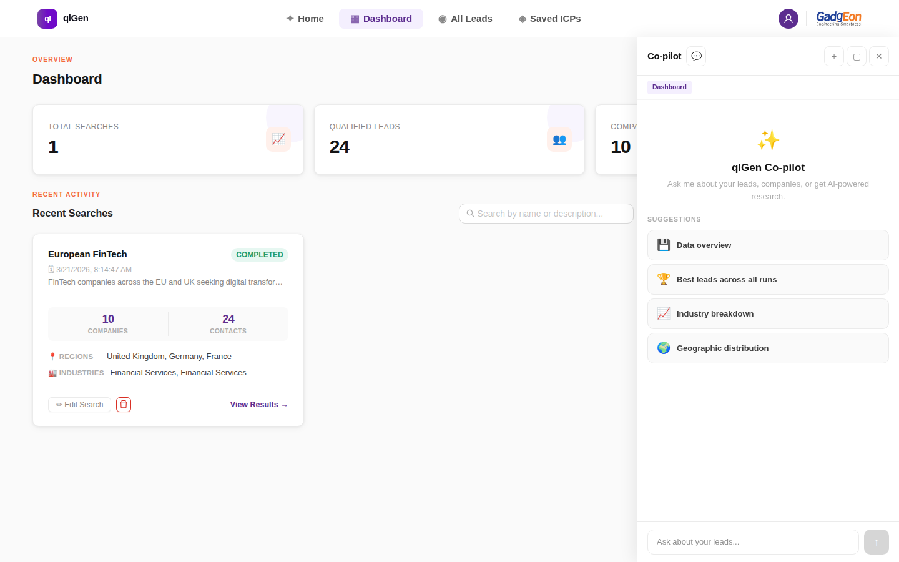

### What It Can Do

- **Search your data**: Ask questions like "Which companies have the highest urgency scores?" or "Show me leads in the UK"
- **Company research**: Request deeper analysis — "Tell me more about Meridian Software" or "What are FinEdge Technologies' recent news?"
- **ICP recommendations**: Get suggestions for improving your search criteria
- **Context-aware**: The co-pilot knows which page you're on and adjusts its suggestions accordingly

### Tips for Using the Co-Pilot

- Be specific in your questions for better results
- Use the **recommendation chips** that appear below the welcome message for quick starting points
- Start a **new chat** (+ button) when switching topics
- The co-pilot has access to both your database and external research tools

---

## Admin Features

The following features are available to **Super Admin** users only. The Tools and Users pages appear in the top navigation bar only for Super Admins.

### User Management

Manage team access from the **Users** page (accessible from the top navigation bar).

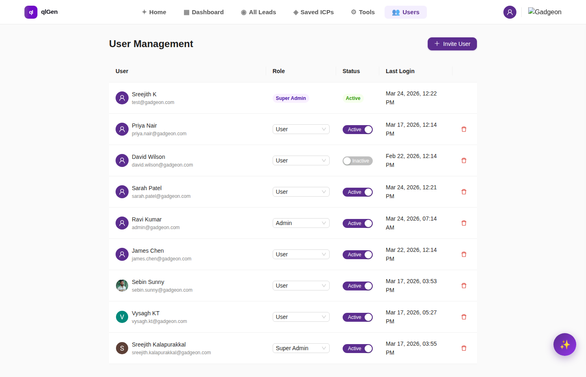

The page displays all users with their role, status, and last login time.

#### Inviting Users

Click **"Invite User"** to add a team member:

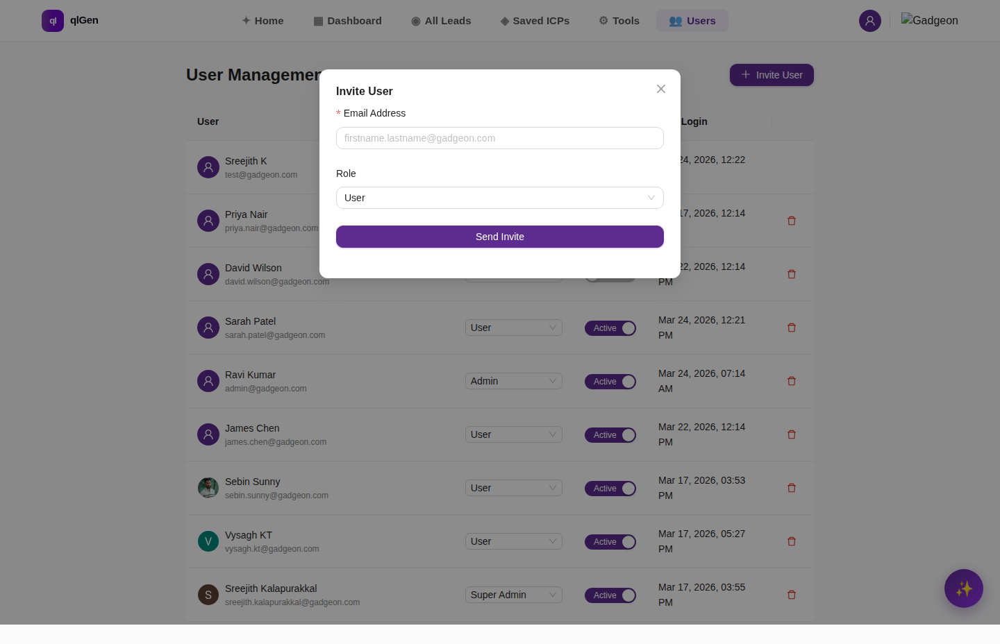

- Enter the user's email address (must match the allowed domain)
- Select a role: **User**, **Admin**, or **Super Admin**
- Click **"Send Invite"**

The invited user will be able to sign in with their Google account.

#### Roles

| Role | Permissions |
|------|------------|
| **User** | Create/edit ICPs, run pipelines, view own results, use co-pilot |
| **Admin** | All user permissions + view all users' data (read-only oversight). Cannot delete other users' resources. |
| **Super Admin** | Full access — manage users, invite/deactivate accounts, access Tools and User Management pages, delete any resource |

#### Deactivating Users

Toggle the **Active** switch on any user row to deactivate their account. Deactivated users cannot sign in.

### Tool Monitoring

The **Tools** page lets Super Admins monitor the health and effectiveness of all external API tools.

#### Registry Tab

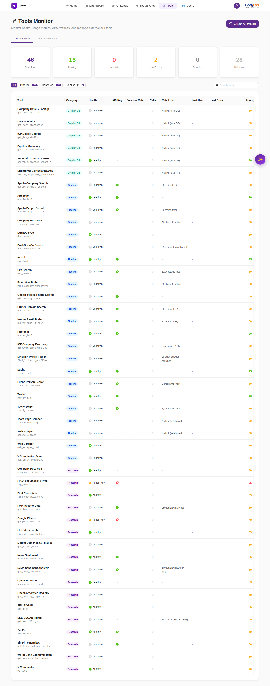

Shows all registered tools with:
- Health status (Healthy, Unhealthy, No API Key, Unknown)
- Category (Pipeline, Research, Co-pilot DB)
- Priority level and enabled/disabled state
- Last health check time

Use **"Check All Health"** to run a live health check across all tools. Filter by category or search by name.

#### Effectiveness Tab

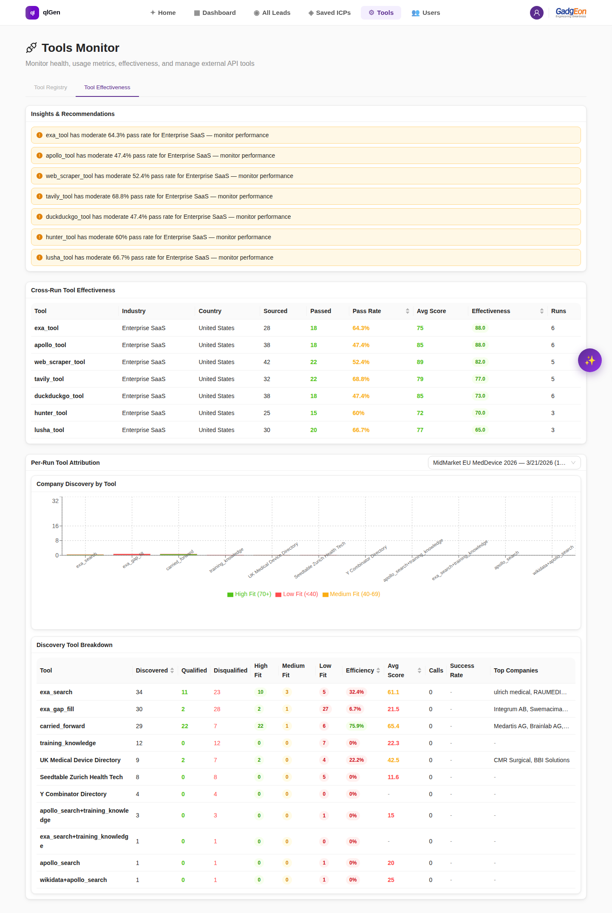

Displays cross-run effectiveness metrics:
- Which tools source the most companies
- Pass rates through pipeline stages
- Average final scores by tool
- Per-run tool attribution

### Admin Dashboard

Super Admins see an additional **Team Activity** section on the Dashboard.

#### Users Tab

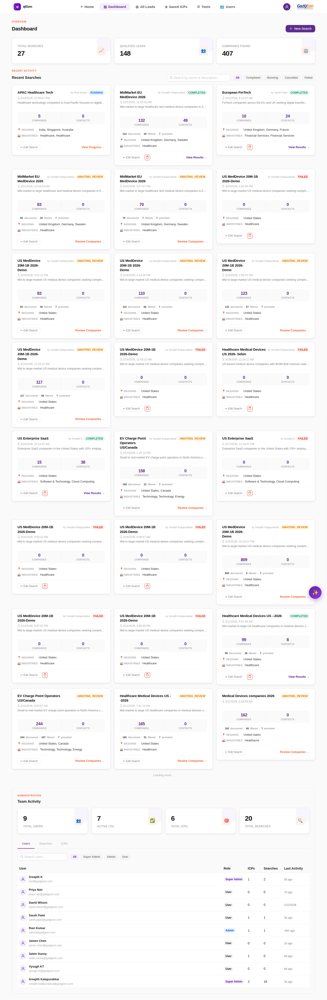

Shows active users, their roles, and recent login activity. Includes admin-only metrics like Total Users and Active (7d).

#### Searches Tab

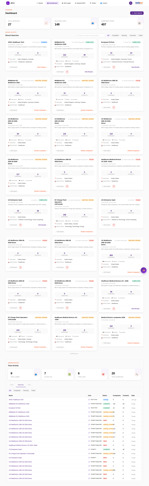

Displays all pipeline runs across all users with status, timing, and result counts.

---

## Tips for Better Results

1. **Be specific with your ICP**: The more detail you provide across all steps (industries, signals, roles), the more targeted the results will be.

2. **Use multiple target roles**: Adding 3-5 leadership titles (e.g., CTO, VP Engineering, Head of Digital) increases the chance of finding the right decision-maker at each company.

3. **Add technology signals**: If your offering relates to specific tech stacks, mention them in the urgency or budget signals.

4. **Use both Budget AND Urgency signals**: Companies with strong scores in both dimensions are more likely to convert.

5. **Clone and iterate**: After reviewing initial results, clone your ICP, adjust criteria, and run again. Each run is independent.

6. **Focus on High-scoring companies first**: Sort by Final Score and prioritize the green-labeled companies for outreach.

7. **Use the co-pilot for deeper research**: Before reaching out to a lead, ask the co-pilot for recent news, competitive context, or executive background.

8. **Check the Pipeline Funnel**: If many companies are filtered out at a specific stage, consider loosening those criteria.

---

## Frequently Asked Questions

**Q: Can I leave the page while a pipeline is running?**
Yes. Results are saved automatically. Return anytime via the Dashboard.

**Q: How many companies does each search find?**
There is no fixed cap. The pipeline casts a wide net in Stage 1 (aiming for hundreds of candidates), then progressively filters through firmographic fit, signal scoring, and contact discovery. The final count of qualified companies depends on how many match your ICP criteria — typical runs surface anywhere from a handful to 50+ qualified leads.

**Q: Can I run the same ICP multiple times?**
Yes. Each run is independent. Use "Run Pipeline" from the Saved ICPs page, the Dashboard card, or the Pipeline page.

**Q: What data sources does qlGen use?**
The pipeline draws on 30+ data sources across all stages, including Apollo.io, Exa.ai, Hunter.io, Lusha, Tavily, DuckDuckGo, Wikidata, SEC EDGAR, government company registries (UK, France, Nordic countries), GitHub, Google Custom Search, patent databases, press releases, ProductHunt, Y Combinator, SimFin, and direct website scraping. The co-pilot has access to additional research tools on top of these.

**Q: Can I edit an ICP after saving it?**
Yes. Go to Saved ICPs, click the card, and choose Edit. Changes don't affect previous search results.

**Q: What format is the export?**
Excel (.xlsx) with formatted columns and styling, or CSV. Both are ready for CRM import.

**Q: How are companies scored and categorized?**

All scores use a 0-100 scale. The summary bar on the results page shows a High / Med / Low breakdown:

| Label | Final Score | Meaning |
|-------|-----------|---------|
| **High** | 75-100 | Strong match — prioritize for outreach |
| **Medium** | 50-74 | Good potential — worth pursuing |
| **Low** | 25-49 | Weaker match — may need nurturing |
| **Very Low** | Below 25 | Minimal match — deprioritize |

**Q: What does "On-Demand Discovery" do?**
It re-runs signal detection or contact search for a single company. Use it when data is stale or you want more detail before outreach.

**Q: Who can see my searches?**
Regular users see only their own searches and results. Admins and Super Admins can view all users' data.

---

*For technical support or questions, contact your system administrator.*
